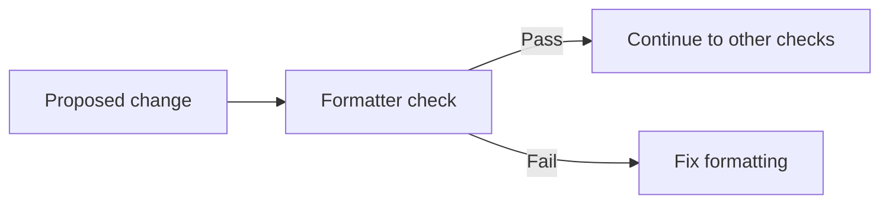

# Format Rust code

Rust code must pass the repository's formatter check.

## Rationale

Consistent formatting keeps code reviews focused on changes in behavior.

```mermaid
flowchart LR
    Change[Proposed change] --> Check[Formatter check]
    Check -->|Pass| Continue[Continue to other checks]
    Check -->|Fail| Fix[Fix formatting]
```
